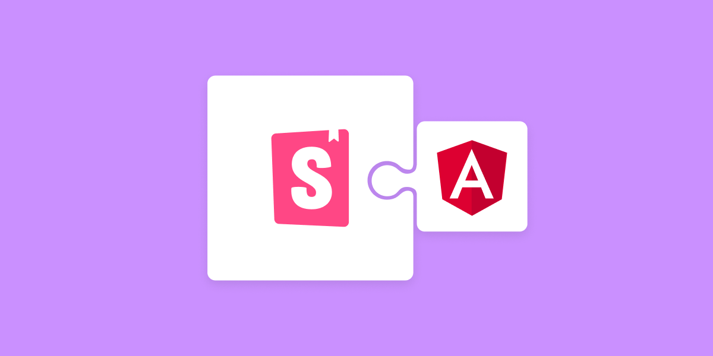
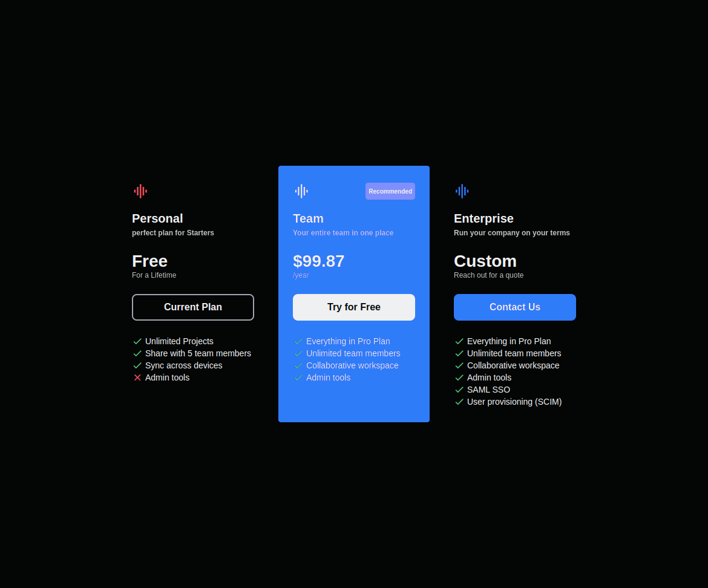

<h1 align="center">
  
</h1>

  <a href="#-tecnologias">Tecnologias</a>&nbsp;&nbsp;&nbsp;|&nbsp;&nbsp;&nbsp;
  <a href="#-projeto">Projeto</a>&nbsp;&nbsp;&nbsp;|&nbsp;&nbsp;&nbsp;
  <a href="#-layout">Layout</a>&nbsp;&nbsp;&nbsp;|&nbsp;&nbsp;&nbsp;
  <a href="#-como-executar">Como executar</a>&nbsp;&nbsp;&nbsp;|&nbsp;&nbsp;&nbsp;
  <a href="#-licença">Licença</a>

 

## ✨ Tecnologias

Esse projeto foi desenvolvido com as seguintes tecnologias:

- [Angular](https://angular.io/)
- [TypeScript](https://www.typescriptlang.org/)
- [Storybook](https://storybook.js.org/docs/angular/get-started/introduction)
- [GitHub Actions](https://docs.github.com/en/actions/)

## 💻 Projeto

Com o objetivo de praticar a configuração do storybook junto com o angular (configurar biblioteca no angular é sempre mais desafiador do que no react kkk) decidi seguir um pouco da metodologia do Atomic Design e quebra um componente de Price Package para utilizar as principais features do storybook como:

- argTypes
- componentWrapperDecorator
- moduleMetadata

Alem de adicionar github action para fazer o deploy automatico na chromatic

Segue abaixo o link do deploy na Chromatic:

Chromatic: [https://www.chromatic.com/library/angular-storybook](https://www.chromatic.com/library?appId=62ce09de13f8b77320c8ea1c)

Storybook Chromatic: [https://www.chromatic.com/library/angular-storybook#storybook](https://62ce09de13f8b77320c8ea1c-ejjfqnocix.chromatic.com/)

## 🔖 Layout

Layout do projeto

## 🚀 Como executar

- Clone o repositório
- Instale as dependências com `yarn`
- Inicie o servidor com `yarn start`
- Inicie o storybook com `yarn storybook`

Agora você pode acessar [`localhost:4200`](http://localhost:4200) do seu navegador.

## 📄 Licença

Esse projeto está sob a licença MIT. Veja o arquivo [LICENSE](LICENSE) para mais detalhes.
